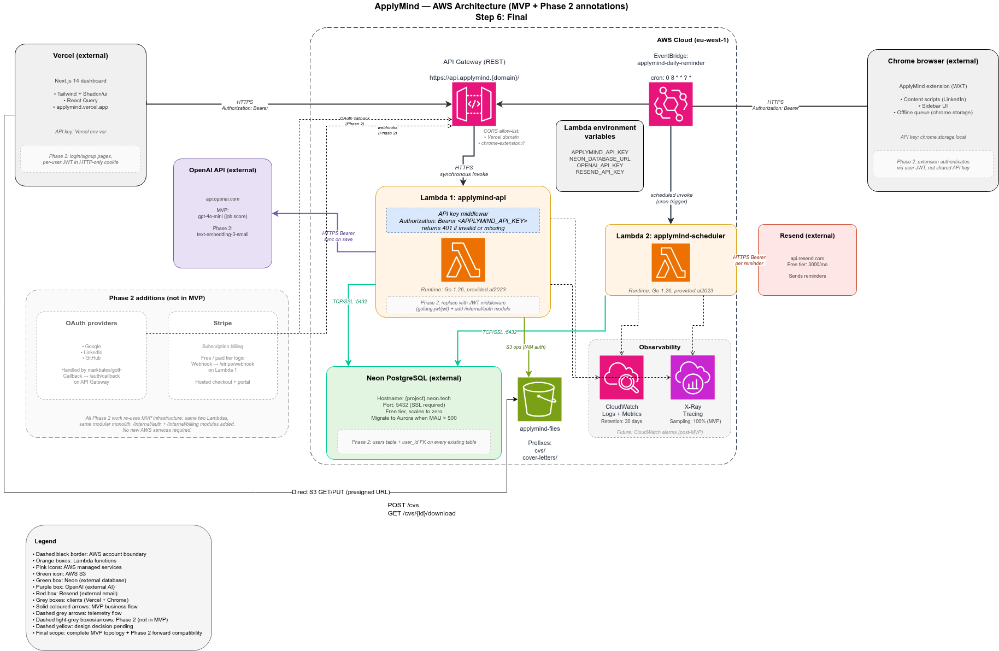
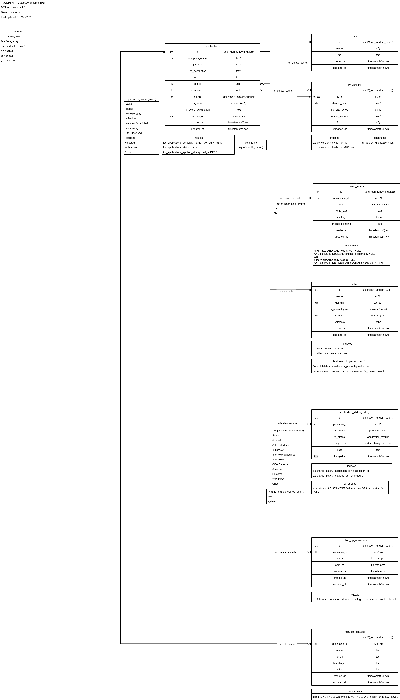
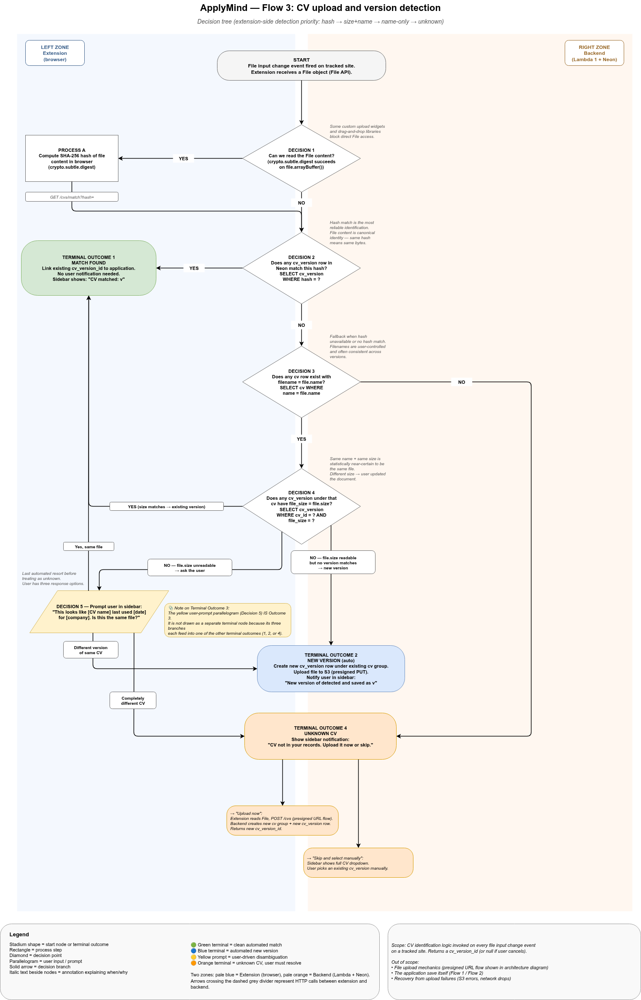
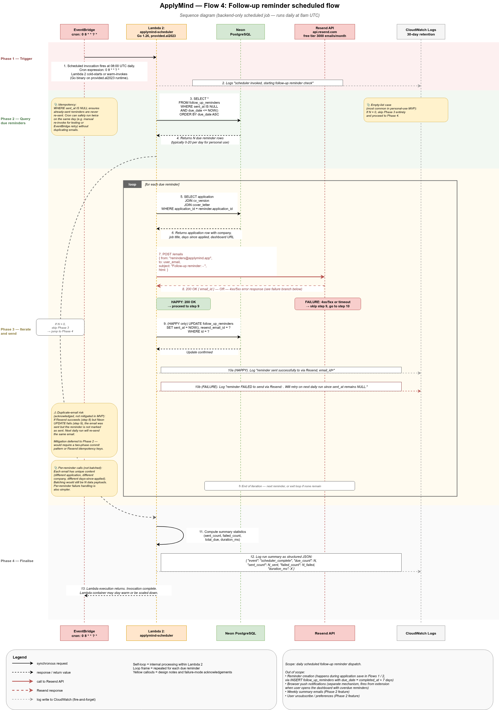
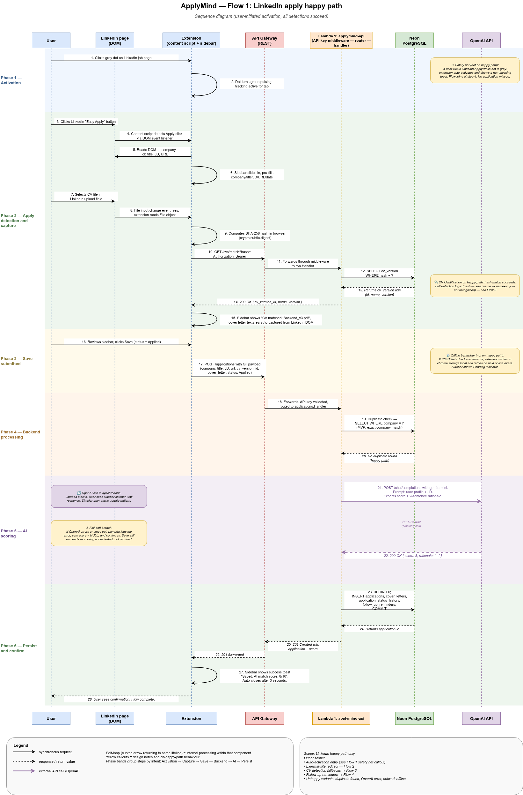
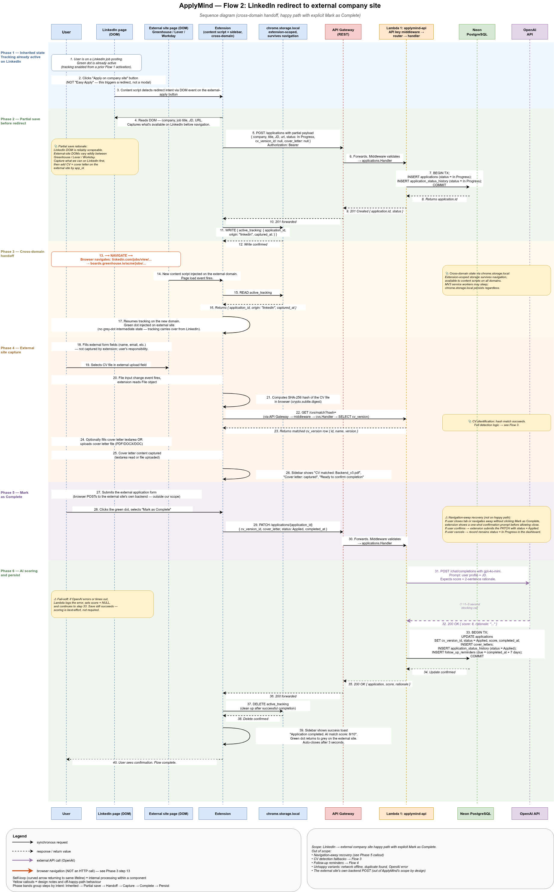

# ApplyMind — Backend

Go backend for ApplyMind, a job application tracker. Runs as two AWS Lambda
functions behind API Gateway, backed by Neon PostgreSQL and S3.

**Status: Phase 1 — foundation only.** Schema, configuration and entry points
are in place; no business logic is implemented yet.

## Architecture

```
extension ─┐
           ├─► API Gateway ──► Lambda 1 (applymind-api) ──► Neon PostgreSQL
dashboard ─┘                          │
                                       └──────────────────► S3

EventBridge (daily cron) ──► Lambda 2 (applymind-scheduler) ──► Neon PostgreSQL
                                       │
                                       └──► Resend (follow-up reminder emails)
```



Both Lambdas share one Go codebase and detect at startup whether they're
running under the Lambda runtime or locally, so the same binary serves both
environments. See [Layout](#layout) below for how the code itself is split.

## Database schema

The full schema below, including every constraint and `ON DELETE` behaviour
between tables, is generated straight from the migrations in `migrations/` via
`sqlc` — nothing here should ever drift from what's actually applied, since
`sqlc` would fail to compile against a schema this diagram doesn't match.



## Requirements

- Go 1.25+
- [`sqlc`](https://sqlc.dev) — `go install github.com/sqlc-dev/sqlc/cmd/sqlc@latest`
- [`golang-migrate`](https://github.com/golang-migrate/migrate) —
  `go install -tags 'postgres' github.com/golang-migrate/migrate/v4/cmd/migrate@latest`
- A Neon PostgreSQL project

## Configuration

Copy `.env.example` to `.env` and fill it in:

```bash
cp .env.example .env
openssl rand -hex 32   # use for APPLYMIND_API_KEY
```

| Variable | Required | Purpose |
|---|---|---|
| `NEON_DATABASE_URL` | yes | App runtime connection. Use the **pooled** (`-pooler`) endpoint. |
| `NEON_DIRECT_URL` | migrations only | Use the **direct** (non-pooled) endpoint. |
| `APPLYMIND_API_KEY` | yes | Static bearer token for all protected routes. |
| `PORT` | no | Local HTTP port. Defaults to `8080`. Ignored under Lambda. |
| `CORS_ALLOWED_ORIGINS` | no | Comma-separated origin allow-list. Defaults to `http://localhost:3000`. |

### Why two connection strings

Migrations must run against the **direct** endpoint. `golang-migrate` takes a
session-level `pg_advisory_lock`, and Neon's pooled endpoint runs PgBouncer in
transaction-pooling mode, where consecutive statements may land on different
backend connections — the lock is acquired and immediately orphaned, so
migrations hang or fail. The application uses the pooled endpoint, which is the
right choice for Lambda's many-short-lived-connections pattern.

## Running migrations

```bash
make migrate-up        # apply all pending migrations
make migrate-version   # show current version
make migrate-down      # roll back one migration
make migrate-drop      # drop everything (destructive)
```

Create a new migration:

```bash
make migrate-create NAME=add_something
```

### If migrations fail partway

`golang-migrate` marks the schema *dirty* on a failed migration and refuses to
continue. If the database holds no data worth keeping, the cleanest reset is to
run this in the Neon SQL editor, then re-run `make migrate-up`:

```sql
DROP SCHEMA public CASCADE;
CREATE SCHEMA public;
```

## Generating query code

`sqlc` reads the schema directly from `migrations/` (ignoring `*.down.sql`) and
the queries from `queries/`, so generated types cannot drift from the applied
schema. Re-run after adding any migration or query:

```bash
make sqlc
```

Generated code lands in `internal/db/sqlc/` and must not be edited by hand.

## Running locally

```bash
make run-api         # http://localhost:8080
make run-scheduler   # executes one scheduled pass, then exits
```

Both binaries detect `AWS_LAMBDA_RUNTIME_API` to decide whether to start the
Lambda runtime or a local process, so the same build runs in both places.

Verify the API is up:

```bash
curl -s localhost:8080/health
# {"status":"ok","database":"reachable"}

curl -s -o /dev/null -w '%{http_code}\n' localhost:8080/applications
# 401

curl -s -o /dev/null -w '%{http_code}\n' \
  -H "Authorization: Bearer $APPLYMIND_API_KEY" localhost:8080/applications
# 404 — authenticated, but no routes are registered yet in Phase 1
```

`/health` is intentionally unauthenticated so uptime checks need no credential.

## Tests

```bash
make test
```

## Layout

```
cmd/api/           Lambda 1 — REST API entry point
cmd/scheduler/     Lambda 2 — EventBridge-triggered reminder entry point
internal/          Feature modules (model / repository / service / handler)
internal/db/sqlc/  Generated — do not edit
migrations/        Sequential golang-migrate SQL files
queries/           Hand-written SQL consumed by sqlc
pkg/config/        Env var loading and validation
pkg/database/      pgx connection pool
pkg/middleware/    HTTP middleware (API key auth)
pkg/storage/       S3 wrapper — stub
pkg/ai/            OpenAI wrapper — stub
```

Each feature module follows the same four-file split: `handler.go` (HTTP only),
`service.go` (business rules), `repository.go` (persistence), `model.go`
(types). Dependencies point inward — handlers never touch the database
directly.

## Key flows

Four sequences worth seeing rather than just reading about.

### CV upload and version detection

Every uploaded CV is hashed with SHA-256 before it's stored. If the hash
already exists under that CV, nothing new is written — the existing version is
returned instead, which is what lets the dashboard say "already stored" rather
than silently duplicating identical bytes.



### Follow-up reminder — scheduled flow

`cmd/scheduler`'s entire job, end to end: EventBridge's daily cron invocation,
the query for reminders due, the per-reminder email dispatch through Resend,
and the failure handling that leaves a reminder unsent (and therefore retried
tomorrow) rather than losing it.



### LinkedIn apply — happy path

Client-side capture, not backend logic — this happens in the browser
extension, before `POST /applications` is ever called. Included here for
context on what that endpoint actually receives and why.



### LinkedIn redirect to an external company site

The other capture path: LinkedIn hands off to a company's own careers page
mid-application. Same reasoning as above — extension-side, shown for context.



## Known deviations from the design documents

| Item | Diagram / ERD says | Implemented as | Why |
|---|---|---|---|
| Neon region | `eu-west-1` | `eu-central-1` | Project was created there. Cross-region Lambda→DB calls add latency; revisit before deploy. |
| `applications.ai_score` | `numeric(3,1)` | `numeric(4,1)` | `numeric(3,1)` caps at 99.9 and cannot store a 0–100 score. |
| `follow_up_reminders.application_id` | `UNIQUE` | partial unique index where not sent/dismissed | Plain UNIQUE allows only one reminder per application for all time. |
| `applications` duplicate guard | not specified | `UNIQUE (site_id, job_url)` | Service-layer checks alone race under concurrent inserts. |
| Auth | API key (MVP) | API key | Phase 2 replaces this with JWT per the diagram's annotation. |

## License

MIT — see [LICENSE](./LICENSE).